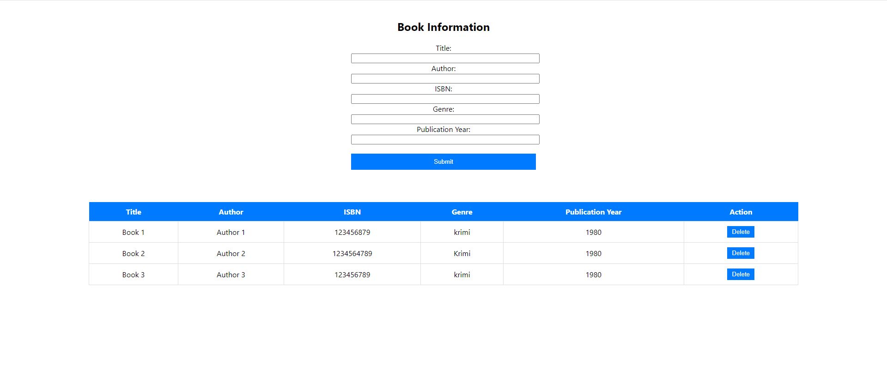

# Book Library Web Application

This is a book library web application that allows users to view, create, edit, and delete books in their library. The project is built using a combination of technologies, including Node.js, Express.js, Sequelize (as the ORM), SQL (SQLite and as host localhost), and React.js, Axios for the front-end.

## Outcome 



## Features

- View the list of books in the library.
- Add a new book to the library with title, author, and description.
- Delete a book from the library.

## Installation

1. Clone this repository to your local machine:

```bash
git clone https://github.com/your-username/book-library.git
